# 🪨 Pebble

**Pebble** is a lightweight, interpreted programming language designed for simplicity and extensibility. Built from the ground up in Go, it offers a familiar C-like syntax with powerful modern features.

[Features](#features) • [Installation](#installation) • [Usage](#usage) • [Roadmap](#next-steps)

## Architecture

```mermaid
graph LR
    Source["Source Code (.pb)"] --> Lexer["Lexer (Lexical Analysis)"]
    Lexer --> Tokens["Tokens"]
    Tokens --> Parser["Parser (Syntactic Analysis)"]
    Parser --> AST["Abstract Syntax Tree (AST)"]
    AST --> Evaluator["Evaluator (Execution)"]
    Evaluator --> Objects["Objects & Environment"]
    Objects --> Output["Result / Side Effects"]
```



## Features
- **Variables**: `var x = 10;`
- **Data Types**: Integers, Booleans, Strings, Functions, Arrays, Hash Maps.
- **Control Flow**: `if/else`, `while`, `for`.
- **Functions**: `fn(x) { return x + 1; }`
- **Built-ins**: `print()`, `len()`.
- **Embeddable**: Can be used as a scripting language for Go applications.

## Installation
Ensure you have Go installed.
```bash
git clone https://github.com/yourusername/pebble.git
cd pebble
```

## Usage

### USE THE EXECUTABLE (directly GO not required)
```bash
./pebble examples/demo.pb
```

### REPL
Start the interactive Read-Eval-Print-Loop:
```bash
go run cmd/pebble/main.go
```

### Running Scripts
Run a Pebble script file:
```bash
go run cmd/pebble/main.go examples/demo.pb
```

## Next Steps

Pebble is evolving! Here are the planned functionalities to transform it into a mid-level programming language:

### Core Language Features
- **Advanced Control Flow**: `switch` statements, and `break`/`continue` support.
- **Structs & Methods**: Custom data types and object-oriented patterns for better data modeling.
- **Modules & Imports**: Support for multi-file projects and code reuse.

### Advanced Capabilities
- **Concurrency**: Lightweight threads (fibers/goroutines) and channels for parallel execution.
- **FFI (Foreign Function Interface)**: Ability to call Go or C functions directly from Pebble.
- **Bytecode Compiler & VM**: Performance optimizations through compilation to bytecode and a dedicated Virtual Machine.

### Ecosystem & Tooling
- **Standard Library**: Expanded built-in functions for Networking (HTTP), JSON/YAML parsing, and Math utilities.
- **Package Manager**: A dedicated tool for managing dependencies and modules.
- **LSP Support**: Language Server Protocol implementation for IDE integration (VS Code, etc.).
- **Testing Framework**: Built-in support for unit and integration tests.
- **Improved Error Handling**: Detailed error messages with line and column information for easier debugging.

