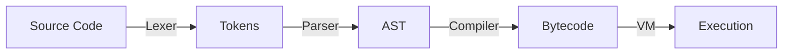

# 🪨 Pebble

**Pebble** is a lightweight, interpreted programming language designed for simplicity and extensibility. Built from the ground up in Go. It is designed for **simplicity, performance, and embeddability**. Pebble aims to evolve into a **high-performance embeddable scripting and configuration language for Go applications**.

---

## 🚀 Vision

Pebble is not just another scripting language.

It is being designed to become:

> A fast, embeddable scripting and configuration engine for Go systems.

Long-term goals include:
- High-performance bytecode VM
- Safe sandbox execution
- First-class Go embedding API
- Modular architecture
- Clean and expressive syntax

Curious about how its fast (read: docs/vm_architecture.md)

## Features
- **Variables**: `var x = 10;`
- **Data Types**: Integers, Booleans, Strings, Functions, Arrays, Hash Maps.
- **Control Flow**: `if/else`, `while`, `for`.
- **Functions**: `fn(x) { return x + 1; }`
- **Built-ins**: `print()`, `len()`.
- **Embeddable**: Can be used as a scripting language for Go applications.

### When to Choose Pebble VM
1. **Embedded Systems**: Small footprint and fast startup
2. **High-performance Scripting**: When speed matters
3. **Go Integration**: Seamless embedding in Go applications
4. **Resource-constrained Environments**: Low memory/CPU usage
5. **Predictable Performance**: No JIT warm-up or GC pauses


## Installation
Ensure you have Go installed.
```bash
git clone https://github.com/yourusername/pebble.git
cd pebble
```

## Architecture

```mermaid
graph LR
    A[Source Code] -->|Lexer| B[Tokens]
    B -->|Parser| C[AST]
    C -->|Compiler| D[Bytecode]
    D -->|VM| E[Execution]
```
## Usage

### USE THE EXECUTABLE (directly Go not required)
```bash
./pebble examples/demo.pb
```

### REPL
Start the interactive Read-Eval-Print-Loop:
```bash
go run cmd/pebble/main.go
```

### Running Scripts
Run a Pebble script file:
```bash
go run cmd/pebble/main.go examples/demo.pb
```

## Next Steps

Pebble is evolving! Here are the planned functionalities to transform it into a mid-level programming language:

### Core Language Features
- **Advanced Control Flow**: `switch` statements, and `break`/`continue` support.
- **Structs & Methods**: Custom data types and object-oriented patterns for better data modeling.
- **Modules & Imports**: Support for multi-file projects and code reuse.

### Advanced Capabilities
- **Concurrency**: Lightweight threads (fibers/goroutines) and channels for parallel execution.
- **FFI (Foreign Function Interface)**: Ability to call Go or C functions directly from Pebble.
- **Bytecode Compiler & VM**: Performance optimizations through compilation to bytecode and a dedicated stack-based Virtual Machine. This approach can provide 10-50x performance improvements over the current tree-walk interpreter by reducing overhead and enabling better optimization opportunities. The implementation will maintain the existing AST evaluator logic while adding a compilation step to bytecode.

### Ecosystem & Tooling
- **Standard Library**: Expanded built-in functions for Networking (HTTP), JSON/YAML parsing, and Math utilities.
- **Package Manager**: A dedicated tool for managing dependencies and modules.
- **LSP Support**: Language Server Protocol implementation for IDE integration (VS Code, etc.).
- **Testing Framework**: Built-in support for unit and integration tests.
- **Improved Error Handling**: Detailed error messages with line and column information for easier debugging.

